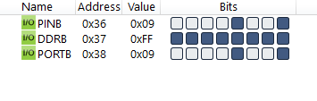

#### *1. Write an AVR C Program to give the value from 0 to 9 on PORTB.*

|[◀️ Prv](../../practical-8/p2/readme.md)|[🏠 Home](/README.md)|[Next ▶️](../p2/readme.md)|
|---|---|---|


```c
#include <avr/io.h>

int main(void)
{
	DDRB = 0xFF;
	unsigned char i;
	for (i = 0; i <= 9; i++)
		PORTB = i;
	return 0;
}
```

