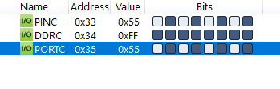
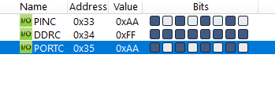

#### *5. Write an AVR C Program to compliment Port C 10000 times. (Note: Only show output of two values)*


|[◀️ Prv](../p4/readme.md)|[🏠 Home](/README.md)|[Next ▶️](../../practical-3/p1/readme.md)|
|---|---|---|

```c
#include <avr/io.h>

int main(void)
{
    DDRC = 0xFF;
    unsigned int i;
    for (i = 0; i < 10000; i++)
        PORTC = ~PORTC;
    return 0;
}
```



