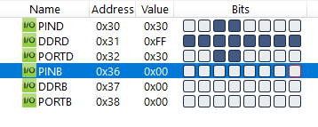
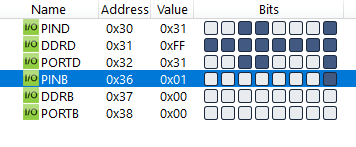
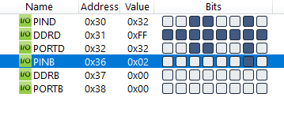
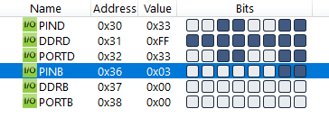

#### *3. Write an AVR C program to read the content of Pin 0 and 1 of PORTB. Send the ASCII value to PORTD  according to the following table :-*


|[◀️ Prv](../p2/readme.md)|[🏠 Home](/README.md)|[Next ▶️](../p4/readme.md)|
|---|---|---|

```
Pin 1       Pin 0     ASCII
  0           0        ‘0’
  0           1        ‘1’
  1           0        ‘2’
  1           1        ‘3’
```

```c
#include <avr/io.h>

int main(void)
{
	DDRB = DDRB & 0b11111100;
	DDRD = 0xFF;
	while (1)
	{
		switch (PINB & 0b00000011)
		{
			case 0:
				PORTD = '0';
				break;
			case 1:
				PORTD = '1';
				break;
			case 2:
				PORTD = '2';
				break;
			case 3:
				PORTD = '3';
				break;
		}
	}		
	return 0;
}
```






