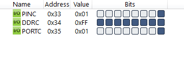
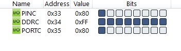

#### *2. Write an AVR C Program to generate the LED pattern as following continuously. Only LED on D0 position is ON and rest of all OFF, D1 is ON and others are OFF and so on. When LED on D7 is ON, it should get turned ON in reverse order.*


|[◀️ Prv](../p1/readme.md)|[🏠 Home](/README.md)|[Next ▶️](../p3/readme.md)|
|---|---|---|

<br />

```c
#include <avr/io.h>
#include <util/delay.h>

int main(void)
{
	DDRC = 0xFF;
	unsigned char i;
	while (1)
	{
		for (i = 0; i < 8; i++)
		{
			PORTC = (1 << i);
			_delay_ms(200);
		}
		for (i = 0; i < 8; i++)
		{
			PORTC = (0x80 >> i);
			_delay_ms(200);
		}
	}
	return 0;
}
```



