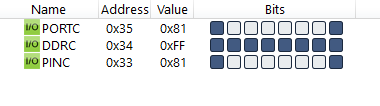
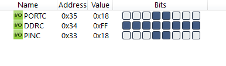

#### *4. Write an AVR C Program to generate the LED pattern as following continuously. Only LED on D0 and D7 position is ON and rest of all OFF, D1 and D6 are ON and others are OFF, D2 and D5 are ON and other are OFF and D3 and D4 are on and rest of all OFF. Again it should start with D3 and D4 and should go in reverse order.*


|[◀️ Prv](../p3/readme.md)|[🏠 Home](/README.md)|[Next ▶️](../../practical-7/p1/readme.md)|
|---|---|---|

<br />

```c
#include <avr/io.h>
#include <util/delay.h>

int main(void)
{
    DDRC = 0xFF;
    unsigned char i;
    while (1)
    {
        for (i = 0; i < 8; i++)
        {
            PORTC = (0x80 >> i) | (1 << i);
            _delay_ms(000);
        }
    }
    return 0;
}
```





