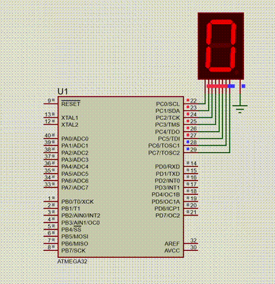

#### *Write an AVR C program to display 0 to 9 continuously on 7-segment display.*

<br />

```c
#include <avr/io.h>
#include <util/delay.h>

unsigned char SEGMENT_CODES[] = {
    0x3F, // 0
    0x06, // 1
    0x5B, // 2
    0x4F, // 3
    0x66, // 4
    0x6D, // 5
    0x7D, // 6
    0x07, // 7
    0x7F, // 8
    0x6F  // 9
};

int main(void)
{
    DDRC = 0xFF; // Set all pins on PORTC as outputs

    while (1)
    {
        for (unsigned char i = 0; i < 10; i++)
        {
            PORTC = SEGMENT_CODES[i];
            _delay_ms(1000);
        }
    }

    return 0;
}
```

