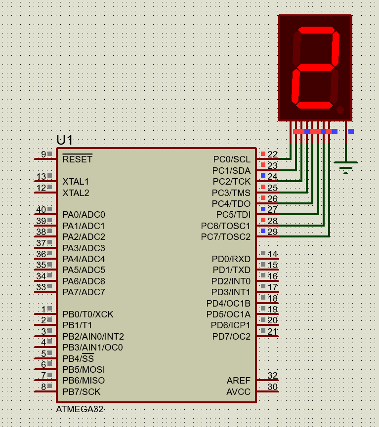

#### *1. Write an AVR C program to display any single digit between 0 to 9 on 7-segment display.*


|[◀️ Prv](../../practical-6/p4/readme.md)|[🏠 Home](/README.md)|[Next ▶️](../p2/readme.md)|
|---|---|---|

<br />

```c
#include <avr/io.h>

int main(void)
{
	DDRC = 0xFF;
    while(1)
        PORTC = 0x5B;
	return 0;
}
```

