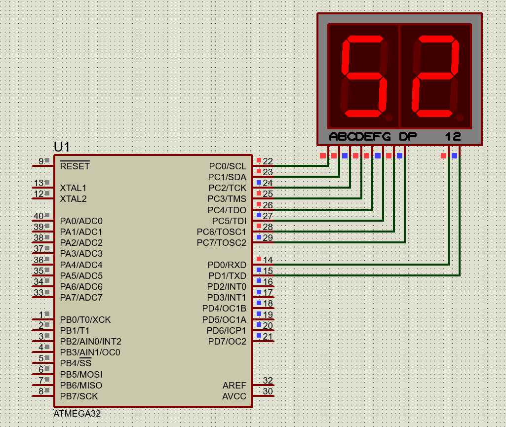

#### *2. Write an AVR C program to display your roll no. on 7-segment display.*


|[◀️ Prv](../p1/readme.md)|[🏠 Home](/README.md)|[Next ▶️](../../practical-8/p1/readme.md)|
|---|---|---|

<br />

```c
#include <avr/io.h>
#include <util/delay.h>

int main(void)
{
	DDRC = 0xFF;
	DDRD = 0xFF;
    while(1)
    {
        PORTD = 0x01;
        PORTC = 0x5B;
        _delay_ms(10);
        PORTD = 0x02;
        PORTC = 0x6D;
        _delay_ms(10);
    }
	return 0;
}
```

