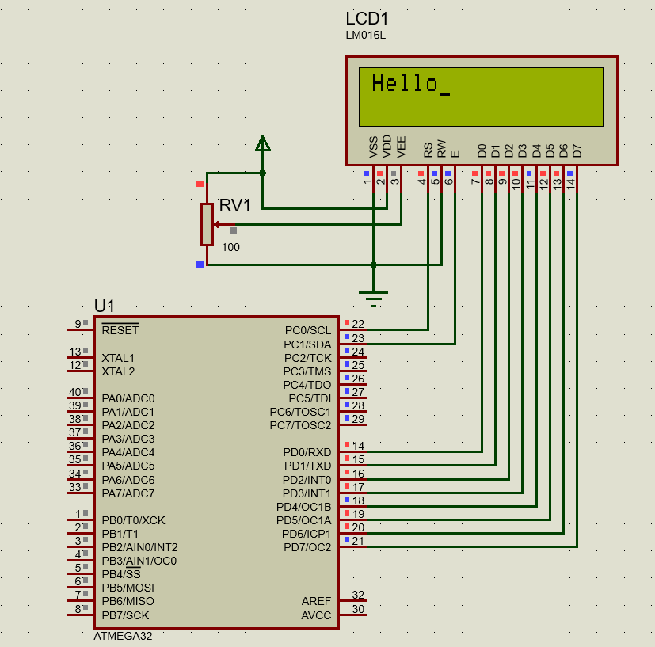

#### *1. Write an AVR C Program to display “HELLO” in 16x2 LCD. Assume Data lines of LCD are connected to PORTB and RS, RW and EN are connected to PD0, PD1 and PD2 respectively.*


|[◀️ Prv](../../practical-7/p2/readme.md)|[🏠 Home](/README.md)|[Next ▶️](../p2/readme.md)|
|---|---|---|

<br />

```c
#include <avr/io.h>
#include <stdio.h>
#include <util/delay.h>
#define F_CPU 16000000UL

void command(unsigned char cmd)
{
    PORTC = 0X02;
    PORTD = cmd;
    PORTC = 0X00;
    _delay_ms(15);
}

void lcd_data(unsigned char data)
{
    PORTC = 0X03;
    PORTD = data;
    PORTC = 0X01;
    _delay_ms(15);
}

void lcd_print(char *p)
{
    while (*p)
    {
        lcd_data(*p++);
    }
}

int main(void)
{
    DDRC = 0XFF;
    DDRD = 0XFF;
    command(0x38);
    command(0X0F);
    command(0x01);
    while (1)
    {
        command(0X80);
        lcd_print("Hello");
        _delay_ms(1000);
        command(0XC0);
        lcd_print("Students");
        _delay_ms(1000);
        command(0X01);
        _delay_ms(1000);
    }
    return 0;
}
```

