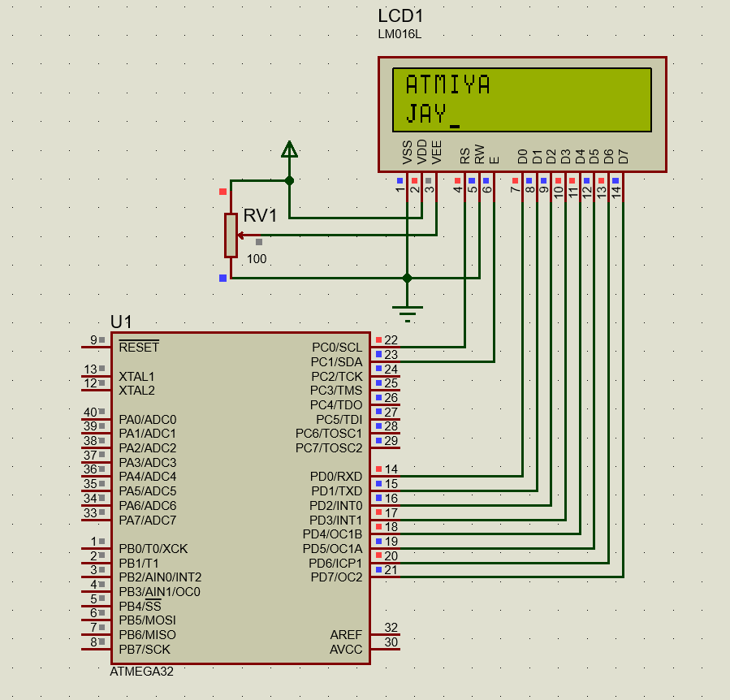

#### *2. Write a Program to display “ATMIYA” in first line and your name on second line of 16x2 LCD in center. Assume the same connections as above.*


|[◀️ Prv](../p1/readme.md)|[🏠 Home](/README.md)|[Next ▶️](../../practical-2/p1/readme.md)|
|---|---|---|

<br />

```c
#include <avr/io.h>
#include <stdio.h>
#include <util/delay.h>
#define F_CPU 16000000UL

void command(unsigned char cmd)
{
	PORTC = 0X02;
	PORTD = cmd;
	PORTC = 0X00;
	_delay_ms(15);
}

void lcd_data(unsigned char data)
{
	PORTC = 0X03;
	PORTD = data;
	PORTC = 0X01;
	_delay_ms(15);
}

void lcd_print(char *p)
{
	while (*p)
	{
		lcd_data(*p++);
	}
}

int main(void)
{
	DDRC = 0XFF;
	DDRD = 0XFF;
	command(0x38);
	command(0X0F);
	command(0x01);
	while (1)
	{
		command(0X80);
		lcd_print("ATMIYA");
		_delay_ms(1000);
		command(0XC0);
		lcd_print("JAY");
		_delay_ms(1000);
		command(0X01);
		_delay_ms(1000);
	}
	return 0;
}
```

